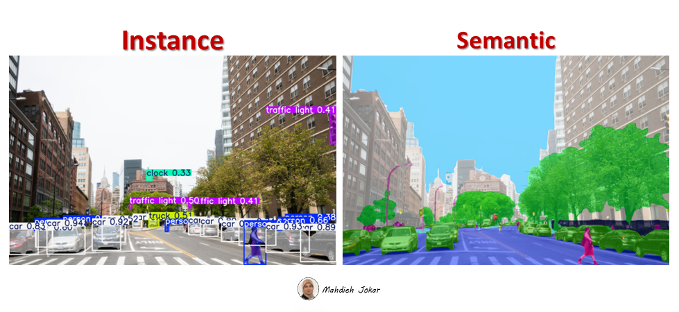

# YOLO26 Segmentation Comparison

This repository compares **instance segmentation** and **semantic segmentation** with Ultralytics YOLO26 models on image and video inputs. It also includes a comparison across semantic segmentation variants (`n`, `m`, and `x`) to highlight the quality-speed trade-off.

## Overview

Two comparison tracks were prepared in this project:

1. **Instance vs. Semantic segmentation** on both image and video.
2. **Semantic model size comparison** across `n`, `m`, and `x` on video.


## 🎥 Visual Results

### Instance vs Semantic
This comparison was performed using the medium (M) variant of each model.

#### Video Comparison


#### Image Comparison



### YOLO26n vs YOLO26m vs YOLO26x

The GIF below compares the three semantic segmentation model sizes. As expected, YOLO26x produces the highest-quality segmentation, while YOLO26n provides significantly faster inference.


## Key Observations

### Instance vs. Semantic

Based on the current experiments:

- On **images**, semantic segmentation produced better visual results than instance segmentation.
- On **videos**, semantic segmentation performed well when motion was not too fast.
- Faster motion made temporal quality less stable, which is an important practical limitation for video use.

### Semantic Size Comparison

Three semantic segmentation sizes were compared on video: `n`, `m`, and `x`.

- The visual difference between the models is noticeable in video outputs.
- As expected, the **`x` model** produced the strongest results among the tested variants.
- This comes with a clear runtime trade-off: better quality requires significantly higher inference time.

## Inference Results
This comparison was performed on an NVIDIA GeForce GTX 1650 GPU using the Ultralytics YOLO framework.

### Instance vs. Semantic Timing

| Model Type | Preprocess | Inference | Postprocess | Input Shape |
|------------|------------|-----------|-------------|-------------|
| Instance Segmentation | 2.2 ms | 126.4 ms | 5.0 ms | (1, 3, 384, 640) |
| Semantic Segmentation | 6.2 ms | 171.6 ms | 9.1 ms | (1, 3, 608, 1024) |

### Semantic Size Timing

| Semantic Model | Preprocess | Inference | Postprocess | Input Shape | Model Size |
|----------------|------------|-----------|-------------|-------------|------------|
| `n` | 6.8 ms | 20.9 ms | 3.3 ms | (1, 3, 608, 1024) | 3.3 MB |
| `m` | 6.0 ms | 178.4 ms | 8.8 ms | (1, 3, 608, 1024) | 27.5 MB |
| `x` | 5.9 ms | 293.4 ms | 5.1 ms | (1, 3, 608, 1024) | 77 MB |

## Trade-off Discussion

The semantic `n` model is much faster and lighter, making it more suitable for speed-sensitive pipelines. The `m` model offers a middle ground, while the `x` model delivers the best quality in this comparison at the highest computational cost.

For real-world deployment, model choice depends on the target constraint:

- Use `n` when latency and resource usage matter most.
- Use `m` for a balance between quality and speed.
- Use `x` when output quality is the top priority and slower inference is acceptable.

## Project Structure

A simple structure for the repository can look like this:

```bash
yolo26-segmentation-comparison/
│
├── seg_vs_sem_compare.py 
├── README.md
│
├── assets/
│   ├── instance-vs-semantic.png
│   ├── instance-vs-semantic.gif
│   └── semantic-n-m-x.gif
│
└── samples/
    ├── video.mp4
    └── image.jpg
```

## How to Run

### 1. Install dependencies

```bash
pip install ultralytics
```

### 2. Run 

```bash
python seg_vs_sem_compare.py --input path/to/input --compare both --sizes n m x
```

Use the `--compare` and `--sizes` arguments to select which models to run.


## Arguments

| Argument | Type | Required | Description |
|----------|------|----------|-------------|
| `--input` | `str` | Yes | Path to the input video or image |
| `--compare` | `str` | No | Comparison mode: `both`, `seg`, or `sem` |
| `--sizes` | `list[str]` | No | Model sizes to test, such as `n s m l x` |


## Notes

- The visual conclusions in this README are based on the prepared comparison image and GIF files from the current experiments.
- The timing numbers reported here are the observed inference logs from the tested runs.


